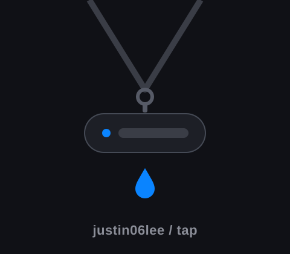

<div align="center">



# homebrew-tap

**Homebrew formulae and casks for justin06lee's apps.**

</div>

---

```bash
brew tap justin06lee/tap
brew install --cask lanyard
```

| Package | What it is |
| --- | --- |
| [`lanyard`](Casks/lanyard.rb) (cask) | [Lanyard](https://github.com/justin06lee/lanyard) — floating name tags for your Claude Code sessions |
| [`hal9000`](Formula/hal9000.rb) (formula) | [HAL 9000](https://github.com/justin06lee/hal9000) — AI project orchestrator TUI managing multiple Claude workers |
